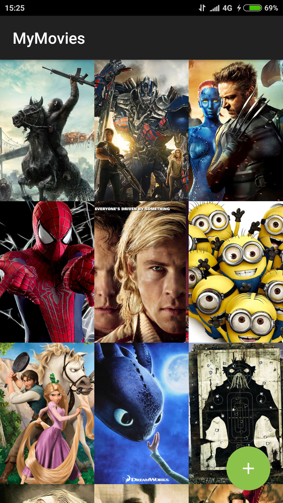
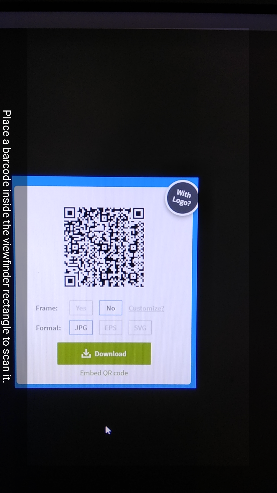
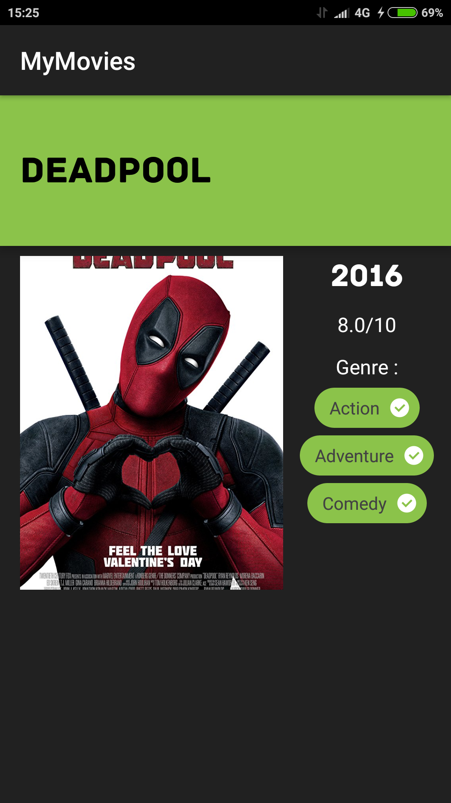

# MoviesQR
Productionize an app as part of an interview test.

## What I Learned
- Use Retrofit HTTP client in background threads.
- Use Picasso Library for image loading.
- Implamentation of ROOM database.
- User Json data stored in ROOM database.
- Connect to API and retrieve JSON data.
- Scan a QR code and retrive JSON data.

## App Description
- Loads the data in backgroud threads using Retrofit while its on the Splash screen.
- Allow the user to tap on a movie poster and transition to a details screen with additional information such as:
	- Original title
	- Movie poster image thumbnail
	- User rating
	- Release date
- Allow the user to rotate the phone and adjust the layouts.
- Allow the user to add new Movies by scanning a QR code.
- Shows all the movies in a descending order.

-----------------------
 
 

